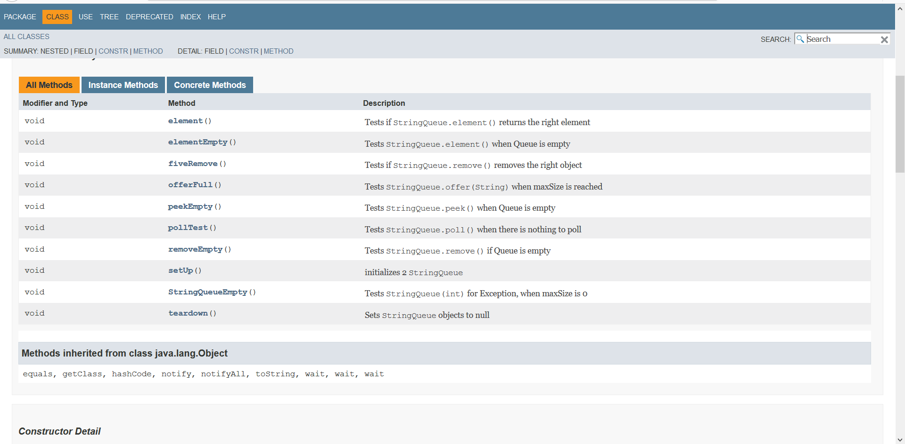

# LAB REPORT
 ### Abgabe 4
- Florian Tandl
- Martin Zellner

Repository: https://github.com/FlorianTandl/19-Abgabe04-Zellner-Tandl

### VORGEHEN
Zu aller erst wurde von Student 1 ein Guthub Repository erstellt mit dem die Studenten Aufgabe 4 lösen. Danach wurde die To-Do Liste auf Github von Student 1 erstellt um sämtliche Punkte des Projekts als Übersicht zu haben. Danach wurden die Taskergebnisse Schritt für Schritt auf Github gestellt… 
Als nächstes bessert Student 1 die Fehler im Code aus.

Student 2 schrieb die JavaDoc für die Methoden und Klassen des Programms. Man kann mit dem Kommandobefehl Javadoc „Dateiname“ daraufhin eine index.html erstellen welche die Java Dokumentation übernimmt.


Student 2 passte daraufhin die pom.xml Datei an nachdem er zum Repository hinzugefügt wurde. Darin wurden die Entwicklerinformationen sowie die Integration der Log4j 2 und Maven Dependencies niedergeschrieben. Des weiteren integrierte Student 2 die Log4j 2 in das Programm welches bei jeder Methode und Fehlermeldung eine Nachricht wirft. Der Log4j2 ermöglicht das loggen während eine Java Application läuft. Sozusagen das überwachen der Aktivitäten. Dieser wurde mithilfe von log4j2.properties erstellt.


Student 2 und 1 erstellen nun auch die Markdown Codes für java und phyton:

```python
if everythingIsOk:
    print "Hello, I am ok!"
else:
    print "Hello, I am sad!"

```

```java
if(everythingIsOk){
System.out.println("Hello, I am ok!");
}
else{
System.out.println("Hello, I am sad);
}
```

Student 1 bearbeitet die StringQueueTest.java Datei und fügt Junit testcases mit javaDoc kommentaren hinzu:





 
### LINKS / LITERATUR
https://kodehelp.com/log4j2-configuration-file-examples/
https://logging.apache.org/log4j/2.x/maven-artifacts.html
http://www.rubycoloredglasses.com/2013/04/languages-supported-by-github-flavored-markdown/
https://github.github.com/gfm/
https://dillinger.io/
http://www.docjar.net/html/api/java/util/Collections.java.html
http://www.oracle.com/technetwork/java/javase/documentation/index-137868.html
https://maven.apache.org/plugins/maven-site-plugin/


# Taskliste

- [x] Übertragen Angabe Taskliste in Markdown Readme 

- [x] Einspielen  Queue Vorlage aus Repository: 

- [x] Taskergebnisse Schritt für Schritt auf Git stellen
- Führung Taskliste 
- Veröffentlichung  in  Gitmit  aktuell  durchgeführten  Tätigkeiten,  z.B.  Testfälle geschriebenso wird auch in der Taskliste diese Aufgabe als erledigt markiert und Testfälle inkl. geänderter Taskliste ins Repository übertragen.

- [x] Korrigieren Sie den Codebzw. Debuggen Sie ihn um die Fehler zu finden
- Es befinden sich gesamt 3 Fehler im Source Code.
- Bei Bedarf Optimieren Sie das Queue Beispiel.
- Ergänzen Sie das Beispiel nach eigenen Ermessen um es testen zu können.

- [x] Erstellen  Sie  für  Klasse  und  alle  Methoden  Kommentare  um  mittels  Javadoc  eine  API Dokumentation zu erzeugen
- IntegrierenSie ein Bild (der generierten Dokumentation) in Ihren Report.


- [x] Erstellung JUnit Tests (vollständig testen, mehrere Varianten)
- Sie   werden die „selben“ Testfälle   mehrfach   erstellen   müssen   um „mehrere Variationen“ für einen möglichst vollständigen  Test zu  erreichen. Achten  Sie dabei mit unterschiedlichen Daten zu testen.
- JavaDoc Kommentare erstellen.oIntegrieren Sie ein Bild (der generierten Dokumentation) in Ihren Report.

- [x] Passen  Sie  Ihr  pom.xml  auf  das  Projekt  an,damit Sie  das  Projekt erstellenaber  auch Dokumentation generieren können.
- EntwicklerInnen Informationenhinzufügen.
- Integration LoggingBibliothek log4j mittels Maven Dependencies.

- [x] Log4j (Version 2) integrieren und in jeder Methode ins Log schreiben
- Siehe aktualisiertes Stack Beispiel.oErstellen Sie einen Statischen Logger der auf die Konsole schreibt.
- Konfigurieren Sie Logger über ein properties File.
- Geben Sie eine Info Lognachricht bei Aufrufeiner jeden Methode aus.
- Geben Sie eine Error Lognachricht aus bevor Sie einen Fehler werfen.
- Ergebnisse (Konsolenausgabe) als Bild in Dokumentationeinfließen lassen.

- [ ] Maven Site Dokumentation erstellen
 - Inklusive Javadoc Code und Javadoc Test Klassen
 - Inklusive Menü mit Verweis auf manuell erstellte Seite
 ▪Seite erläutert Funktionsweise Queue
 - Geben Sie ein Bild der Maven Site Dokumentation in den Lab Report
 ▪Der Inhalt der manuell erstellten Seite sollte ersichtlich sein.

- [x] Erstellung detaillierter und nachvollziehbarer Markdown Lab Report
- Übertragung Information aus Labreport Template.
- Alle Schritte dieser Übung nachvollziehbar erläutern.
- Übung  Github  Flavor: Erstellen  Sie  einen  Codeblock  im  Dokument,  welcher  3 Zeilen Pythonund 3 Zeilen JavaSourceCode korrekt darstellt.
- Korrekturlesen Dokumentation
- PDF erstellen (zB Dillinger)

- [x] Überprüfung Vollständigkeit der Abgabe

- [x] Abgabe PDF Version der Abgabe

